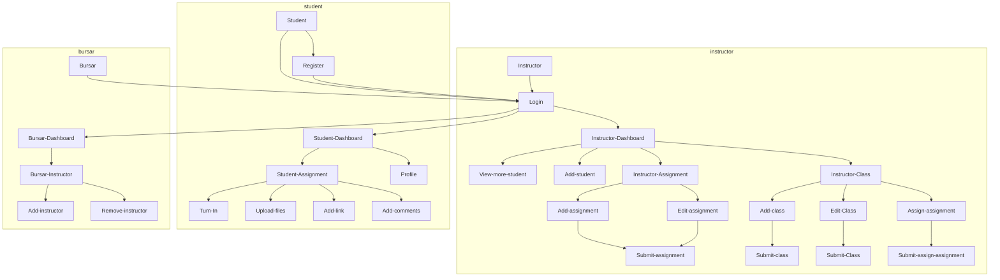

## Project Presentation
https://docs.google.com/presentation/d/1dzw-Ac4YdqpA1DPqyT51CJ1cJouLfDsJhO5-TkNjLbg/edit?usp=sharing

## Project Live Preview
https://methsarah.tech/

## Current Progress
_Dictonary:_
> **✓** : Completed | **-** : Not Started | **UD** : Under Development | **N/A** : Not Applicable

| | UI | DB | Integration |
|--------------|:-------:|:-------:|:----------------|
|Home Page|✓|N/A|✓|
|Student Signup|✓|✓|✓|
|Student Login|✓|✓|✓|
|Student Dashboard|✓|UD|UD|
|Instructor Signup|✓|✓|✓|
|Instructor Login|✓|✓|✓|
|Instructor Dashboard|✓|-|-|
|Bursar Login|-|-|-|
|Bursar Dashboard|-|-|-|
|AI Chatbot|UD|UD|-|

## Login Roles
|Role|ID|
|-----|:-----|
|Bursar|0|
|Instructor|1|
|Student|2|

## External Libraries and Extensions
Quill JS Rich Text Editor Version 2.0.0-rc.2 - https://quilljs.com/ .\
IBM watsonx Assistant Lite

## Page Flow

